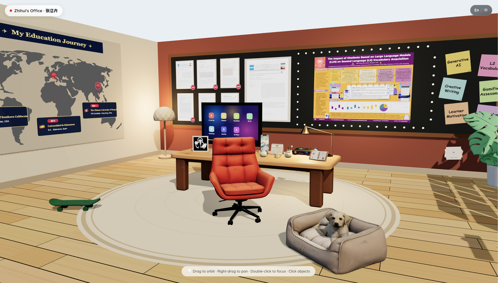
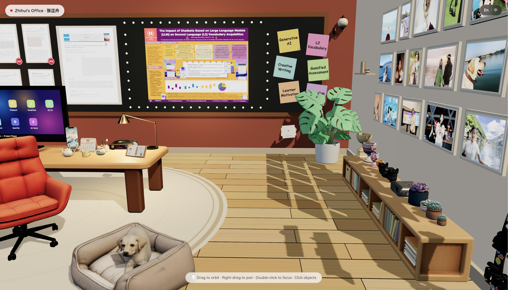
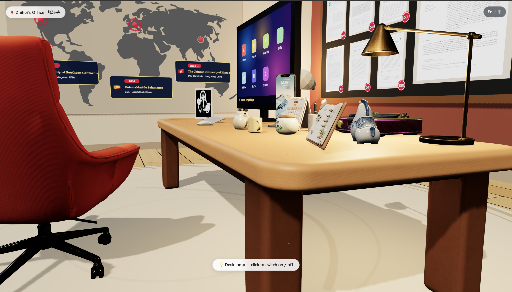

# 🏢 Zhihui's 3D Office · 张淽卉的学术工作室

> An interactive **3D academic portfolio** — walk through a cozy virtual office where every object tells a story: the education world map, the research bulletin board, the photo gallery wall, and a dog napping by the desk.

一间可以走进去的 **3D 学术简历**：在教育地图墙、论文软木板、照片墙之间漫游，点一点台灯、翻一翻手帐，每个物件都藏着一段经历。



## ✨ Features

- **Immersive 3D scene** — a fully modeled office: desk, chair, lamp, plants, bookshelf, photo wall, and a sleepy dog 🐕
- **Clickable objects** — e.g. click the desk lamp to switch it on/off; double-click anything to focus
- **Education Journey map** — Salamanca → Los Angeles → Hong Kong, pinned on a world map
- **Research bulletin board** — selected papers & research themes posted like sticky notes
- **Gallery wall** — life moments framed along the corridor
- **Bilingual** — English / 中文 toggle

## 🕹️ Controls

| 操作 | 效果 |
| --- | --- |
| Drag | Orbit 环绕视角 |
| Right-drag | Pan 平移 |
| Double-click | Focus 聚焦物件 |
| Click | 与物件互动（如开关台灯） |

## 📸 更多视角

| 照片墙走廊 | 书桌特写 |
| --- | --- |
|  |  |

## 🚀 运行

```bash
npm install
npm run dev
```

## 🛠️ Tech Stack

Three.js · React 19 · TypeScript · Vite · Tailwind CSS — 所有 3D 模型（GLB）本地加载

---

Made with ❤️ and too much coffee · © 2026 Zhihui Zhang
